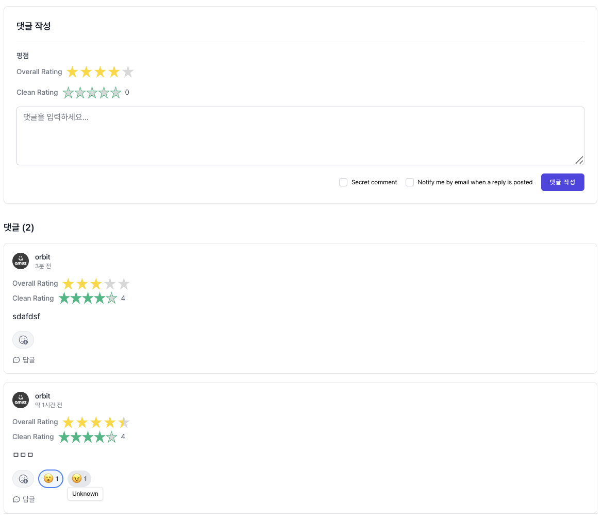
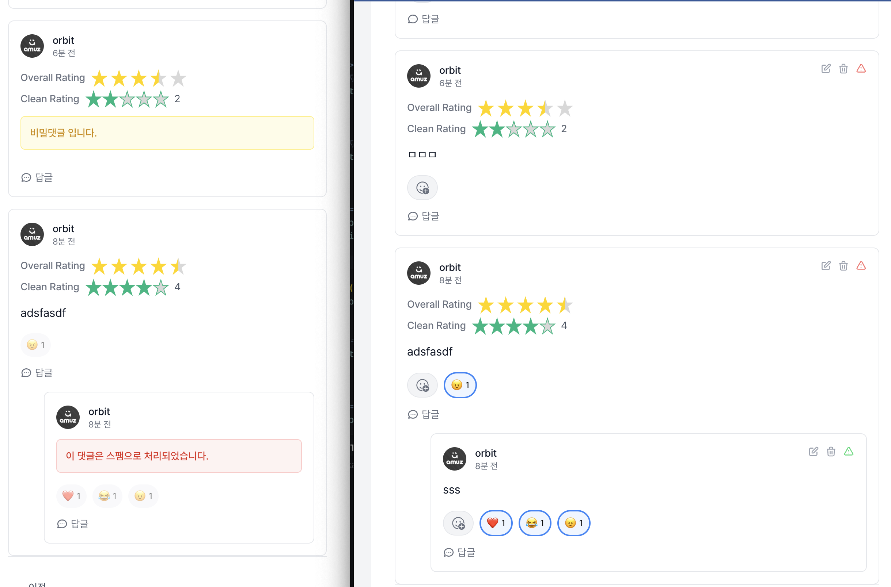

# CMS-Orbit Comments Package

<div align="center">


**강력하고 유연한 댓글 시스템으로 웹사이트에 생동감을 더하세요!**

</div>

---

## 📋 목차

- [소개](#-소개)
- [주요 기능](#-주요-기능)
- [스크린샷](#-스크린샷)
- [설치 및 설정](#-설치-및-설정)
- [빠른 시작](#-빠른-시작)
- [상세 가이드](#-상세-가이드)
- [API 문서](#-api-문서)
- [컴포넌트 레퍼런스](#-컴포넌트-레퍼런스)
- [고급 기능](#-고급-기능)
- [문제 해결](#-문제-해결)
- [기여하기](#-기여하기)

---

## 🚀 소개

CMS-Orbit Comments Package는 Laravel 기반 웹사이트에 강력하고 유연한 댓글 시스템을 제공하는 패키지입니다. 다양한 모델에 댓글 기능을 쉽게 추가할 수 있으며, 평점 시스템, 반응 기능, 답글 시스템 등 풍부한 기능을 제공합니다.

### ✨ 특징

- **🔧 모델별 독립 설정**: 각 모델마다 다른 댓글 정책 설정 가능
- **⭐ 평점 시스템**: 다중 카테고리 평점 지원
- **😊 반응 시스템**: 이모지 기반 반응 기능
- **💬 계층적 답글**: 무제한 깊이의 답글 시스템
- **👥 게스트 지원**: 로그인 없이도 댓글 작성 가능
- **🔒 보안 기능**: 스팸 방지, 비밀글, 검토 시스템
- **📱 반응형 디자인**: 모든 디바이스에서 완벽 지원
- **🌐 다국어 지원**: 완전한 국제화 지원

---

## 🎯 주요 기능

### 📝 기본 댓글 기능
- ✅ **댓글 작성/수정/삭제**: 완전한 CRUD 기능
- ✅ **답글 시스템**: 계층적 댓글 구조 지원
- ✅ **페이지네이션**: 효율적인 댓글 로딩
- ✅ **실시간 업데이트**: 새 댓글 실시간 반영

### ⭐ 평점 시스템
- ✅ **다중 카테고리**: 전체, 서비스, 시설, 가치 등
- ✅ **반별 평점**: 0.5단위 세밀한 평점
- ✅ **평점 통계**: 평균, 분포, 요약 정보
- ✅ **커스텀 평점**: 모델별 맞춤 평점 카테고리

### 😊 반응 시스템
- ✅ **이모지 반응**: 👍❤️😂😮😢😠 등 다양한 반응
- ✅ **반응 통계**: 각 반응별 개수 표시
- ✅ **사용자별 반응**: 개인화된 반응 관리

### 👥 사용자 관리
- ✅ **게스트 댓글**: 로그인 없이 댓글 작성
- ✅ **사용자 인증**: 로그인 사용자 댓글
- ✅ **아바타 지원**: 사용자 프로필 이미지
- ✅ **권한 관리**: 역할 기반 접근 제어

### 🔒 보안 및 관리
- ✅ **스팸 방지**: 허니팟, 요청 제한
- ✅ **검토 시스템**: 관리자 승인/거부
- ✅ **비밀글**: 특정 권한만 볼 수 있는 댓글
- ✅ **신고 기능**: 부적절한 댓글 신고

### 📱 사용자 경험
- ✅ **반응형 디자인**: 모든 디바이스 지원
- ✅ **접근성**: WCAG 가이드라인 준수
- ✅ **키보드 네비게이션**: 완전한 키보드 지원
- ✅ **로딩 상태**: 사용자 친화적 로딩 표시

---

## 📸 스크린샷

### 댓글 작성 화면


*사용자가 댓글을 작성하는 화면입니다. 평점 시스템과 반응 기능이 활성화되어 있습니다.*

### 스팸 방지 및 비밀글 기능


*스팸 방지 기능과 비밀글 설정이 적용된 관리자 화면입니다.*

---

## 🛠 설치 및 설정

### 1. 패키지 설치

```bash
composer require cms-orbit/comments
```

### 2. 마이그레이션 실행

```bash
php artisan migrate
```

### 3. 설정 파일 발행

```bash
php artisan vendor:publish --tag=orbit-comments-config
```

### 4. 환경 변수 설정

`.env` 파일에 다음 설정을 추가하세요:

```env
# 댓글 시스템 기본 설정
COMMENTS_MODERATION_ENABLED=false
COMMENTS_RATINGS_ENABLED=true
COMMENTS_REACTIONS_ENABLED=true
COMMENTS_GUEST_ENABLED=true

# 보안 설정
COMMENTS_SPAM_PROTECTION_ENABLED=true
COMMENTS_RATE_LIMIT_ENABLED=true
COMMENTS_RATE_LIMIT_MAX_ATTEMPTS=5
COMMENTS_RATE_LIMIT_DECAY_MINUTES=1

# 표시 설정
COMMENTS_PER_PAGE=10
COMMENTS_MAX_DEPTH=5
COMMENTS_SHOW_AVATARS=true
COMMENTS_SHOW_TIMESTAMPS=true
```

---

## ⚡ 빠른 시작

### 1. 모델에 HasComments Trait 추가

```php
<?php

namespace App\Models;

use CmsOrbit\Comments\Traits\HasComments;
use Illuminate\Database\Eloquent\Model;

class Post extends Model
{
    use HasComments;
    
    // 모델별 댓글 설정 (선택사항)
    public static function commentConfigs(): array
    {
        $baseConfigs = parent::commentConfigs();
        
        return array_merge($baseConfigs, [
            'moderation' => [
                'enabled' => true,
                'auto_approve' => false,
                'require_approval' => true,
            ],
            'ratings' => [
                'enabled' => true,
                'categories' => [
                    'custom' => [
                        'content_quality' => '콘텐츠 품질',
                        'usefulness' => '유용성',
                        'readability' => '가독성',
                    ],
                ],
            ],
            'display' => [
                'per_page' => 20,
                'max_depth' => 3,
            ],
        ]);
    }
}
```

### 2. Vue 컴포넌트에서 사용

```vue
<script setup>
import Comment from '@orbit/comments/Comment.vue'
</script>
<template>
    <div class="post-detail">
        <h1>{{ post.title }}</h1>
        <p>{{ post.content }}</p>
        
        <!-- 댓글 시스템 호출 -->
        <Comment
            :commentable-type="'App\\Models\\Post'"
            :commentable-id="post.id"
        />
    </div>
</template>

<script setup>
import { ref } from 'vue'
import Comment from '@orbit/comments/Comment.vue'

const post = ref({
    id: 1,
    title: '샘플 포스트',
    content: '이것은 샘플 포스트입니다.'
})

const handleCommentAdded = (comment) => {
    console.log('새 댓글이 추가되었습니다:', comment)
}

const handleReplyAdded = (reply) => {
    console.log('새 답글이 추가되었습니다:', reply)
}

const handleReactionToggled = (data) => {
    console.log('반응이 토글되었습니다:', data)
}

const handleRatingAdded = (data) => {
    console.log('평점이 추가되었습니다:', data)
}
</script>
```

### 3. 라우트 설정

```php
// routes/web.php
Route::get('/posts/{post}', function (Post $post) {
    return Inertia::render('Post/Show', [
        'post' => $post,
    ]);
});
```

---

## 📚 상세 가이드

### 모델 설정

#### 기본 설정

모든 모델은 `HasComments` trait을 사용하여 기본 댓글 기능을 활성화할 수 있습니다:

```php
use CmsOrbit\Comments\Traits\HasComments;

class Product extends Model
{
    use HasComments;
}
```

#### 커스텀 설정

모델별로 다른 댓글 정책을 설정할 수 있습니다:

```php
class Review extends Model
{
    use HasComments;
    
    public static function commentConfigs(): array
    {
        $baseConfigs = parent::commentConfigs();
        
        return array_merge($baseConfigs, [
            'moderation' => [
                'enabled' => true,
                'auto_approve' => false,
                'require_approval' => true,
            ],
            'ratings' => [
                'enabled' => true,
                'categories' => [
                    'overall' => [
                        'title' => '전체 평가',
                        'required' => true,
                    ],
                    'service' => [
                        'title' => '서비스 품질',
                        'required' => false,
                    ],
                    'value' => [
                        'title' => '가격 대비 만족도',
                        'required' => false,
                    ],
                ],
            ],
            'reactions' => [
                'enabled' => true,
                'types' => [
                    'helpful' => '👍',
                    'love' => '❤️',
                    'disagree' => '👎',
                ],
            ],
            'guest' => [
                'enabled' => false, // 리뷰는 로그인 필수
            ],
            'display' => [
                'per_page' => 15,
                'max_depth' => 2,
                'show_avatars' => true,
                'show_timestamps' => true,
            ],
        ]);
    }
}
```

### 설정 파일

`config/orbit-comments.php` 파일에서 전역 설정을 관리할 수 있습니다:

```php
return [
    'moderation' => [
        'enabled' => env('COMMENTS_MODERATION_ENABLED', false),
        'auto_approve' => env('COMMENTS_AUTO_APPROVE', true),
        'require_approval' => env('COMMENTS_REQUIRE_APPROVAL', false),
    ],
    
    'ratings' => [
        'enabled' => env('COMMENTS_RATINGS_ENABLED', true),
        'max_rating' => env('COMMENTS_MAX_RATING', 5),
        'allow_half_ratings' => env('COMMENTS_ALLOW_HALF_RATINGS', true),
        'categories' => [
            'overall' => [
                'title' => __('Overall Rating'),
                'max_rating' => 5,
                'increment' => 0.5,
                'border_width' => 3,
                'border_color' => '#ffd700',
                'fill_color' => '#ffd700',
                'star_size' => 20,
                'star_spacing' => 2,
                'show_rating' => true,
                'read_only' => false,
                'disable_click' => false,
                'rtl' => false,
                'fixed_points' => null,
                'glow' => 0,
                'glow_color' => '#ffd700',
                'text_class' => 'text-sm text-gray-600',
                'required' => true,
            ],
            'service' => [
                'title' => __('Service Rating'),
                'max_rating' => 5,
                'increment' => 0.5,
                'border_width' => 2,
                'border_color' => '#3b82f6',
                'fill_color' => '#3b82f6',
                'star_size' => 18,
                'star_spacing' => 1,
                'show_rating' => true,
                'read_only' => false,
                'disable_click' => false,
                'rtl' => false,
                'fixed_points' => null,
                'glow' => 0,
                'glow_color' => '#3b82f6',
                'text_class' => 'text-sm text-gray-600',
                'required' => false,
            ],
            'facility' => [
                'title' => __('Facility Rating'),
                'max_rating' => 5,
                'increment' => 0.5,
                'border_width' => 2,
                'border_color' => '#8b5cf6',
                'fill_color' => '#8b5cf6',
                'star_size' => 18,
                'star_spacing' => 1,
                'show_rating' => true,
                'read_only' => false,
                'disable_click' => false,
                'rtl' => false,
                'fixed_points' => null,
                'glow' => 0,
                'glow_color' => '#8b5cf6',
                'text_class' => 'text-sm text-gray-600',
                'required' => false,
            ],
            'value' => [
                'title' => __('Value Rating'),
                'max_rating' => 5,
                'increment' => 0.5,
                'border_width' => 2,
                'border_color' => '#f59e0b',
                'fill_color' => '#f59e0b',
                'star_size' => 18,
                'star_spacing' => 1,
                'show_rating' => true,
                'read_only' => false,
                'disable_click' => false,
                'rtl' => false,
                'fixed_points' => null,
                'glow' => 0,
                'glow_color' => '#f59e0b',
                'text_class' => 'text-sm text-gray-600',
                'required' => false,
            ],
        ],
    ],
    
    'reactions' => [
        'enabled' => env('COMMENTS_REACTIONS_ENABLED', true),
        'types' => [
            'like' => '👍',
            'love' => '❤️',
            'laugh' => '😂',
            'wow' => '😮',
            'sad' => '😢',
            'angry' => '😠',
        ],
    ],
    
    'display' => [
        'per_page' => env('COMMENTS_PER_PAGE', 10),
        'max_depth' => env('COMMENTS_MAX_DEPTH', 5),
        'show_avatars' => env('COMMENTS_SHOW_AVATARS', true),
        'show_timestamps' => env('COMMENTS_SHOW_TIMESTAMPS', true),
    ],
    
    'guest' => [
        'enabled' => env('COMMENTS_GUEST_ENABLED', true),
        'require_captcha' => env('COMMENTS_GUEST_REQUIRE_CAPTCHA', true),
        'require_email' => env('COMMENTS_GUEST_REQUIRE_EMAIL', true),
        'require_name' => env('COMMENTS_GUEST_REQUIRE_NAME', true),
    ],
    
    'security' => [
        'rate_limit_enabled' => env('COMMENTS_RATE_LIMIT_ENABLED', true),
        'rate_limit_max_attempts' => env('COMMENTS_RATE_LIMIT_MAX_ATTEMPTS', 5),
        'rate_limit_decay_minutes' => env('COMMENTS_RATE_LIMIT_DECAY_MINUTES', 1),
        'spam_protection_enabled' => env('COMMENTS_SPAM_PROTECTION_ENABLED', true),
        'honeypot_field' => env('COMMENTS_HONEYPOT_FIELD', 'website'),
    ],
];
```

---

## 🔌 API 문서

### 댓글 설정 조회

```http
GET /api/orbit-comments/comment/configs?commentable_type=App\\Models\\Post
```

**응답 예제:**
```json
{
    "success": true,
    "data": {
        "moderation": {
            "enabled": false,
            "auto_approve": true,
            "require_approval": false
        },
        "ratings": {
            "enabled": true,
            "categories": {
                "overall": {
                    "title": "Overall Rating",
                    "required": true
                }
            }
        },
        "reactions": {
            "enabled": true,
            "types": {
                "like": "👍",
                "love": "❤️"
            }
        }
    }
}
```

### 댓글 목록 조회

```http
GET /api/orbit-comments/comment?commentable_type=App\\Models\\Post&commentable_id=1&page=1&per_page=10
```

**응답 예제:**
```json
{
    "success": true,
    "data": {
        "comments": [
            {
                "id": 1,
                "content": "정말 좋은 글이네요!",
                "user": {
                    "id": 1,
                    "name": "사용자",
                    "avatar": "https://example.com/avatar.jpg"
                },
                "ratings": {
                    "overall": 4.5
                },
                "reactions": {
                    "like": 3,
                    "love": 1
                },
                "created_at": "2024-01-01T00:00:00.000000Z",
                "replies": []
            }
        ],
        "pagination": {
            "current_page": 1,
            "last_page": 5,
            "per_page": 10,
            "total": 50
        }
    }
}
```

### 댓글 작성

```http
POST /api/orbit-comments/comment
Content-Type: application/json

{
    "commentable_type": "App\\Models\\Post",
    "commentable_id": 1,
    "content": "댓글 내용입니다.",
    "guest_name": "게스트 사용자",
    "guest_email": "guest@example.com",
    "ratings": {
        "overall": 4.5,
        "service": 5.0
    }
}
```

**응답 예제:**
```json
{
    "success": true,
    "data": {
        "id": 2,
        "content": "댓글 내용입니다.",
        "user": {
            "id": null,
            "name": "게스트 사용자",
            "avatar": null
        },
        "ratings": {
            "overall": 4.5,
            "service": 5.0
        },
        "created_at": "2024-01-01T00:00:00.000000Z"
    }
}
```

### 반응 토글

```http
POST /api/orbit-comments/reactions/{comment_id}
Content-Type: application/json

{
    "type": "like"
}
```

### 평점 추가

```http
POST /api/orbit-comments/ratings/{comment_id}
Content-Type: application/json

{
    "ratings": {
        "overall": 4.5,
        "service": 5.0
    }
}
```

---

## 🧩 컴포넌트 레퍼런스

### Comment 컴포넌트

메인 댓글 컴포넌트입니다.

#### Props

| Prop | Type | Default | Description |
|------|------|---------|-------------|
| `commentableType` | String | - | 댓글을 작성할 모델의 클래스명 |
| `commentableId` | Number/String | - | 댓글을 작성할 모델의 ID |
| `initialComments` | Array | [] | 초기 댓글 목록 |
| `pagination` | Object | null | 페이지네이션 정보 |

#### Events

| Event | Payload | Description |
|-------|---------|-------------|
| `comment-added` | `{comment}` | 새 댓글이 추가되었을 때 |
| `reply-added` | `{reply, parentComment}` | 새 답글이 추가되었을 때 |
| `reaction-toggled` | `{commentId, type, count}` | 반응이 토글되었을 때 |
| `rating-added` | `{commentId, ratings}` | 평점이 추가되었을 때 |

#### 사용 예제

```vue
<template>
    <Comment
        :commentable-type="'App\\Models\\Post'"
        :commentable-id="post.id"
        :initial-comments="post.comments"
        :pagination="post.comments_pagination"
        @comment-added="handleCommentAdded"
        @reply-added="handleReplyAdded"
        @reaction-toggled="handleReactionToggled"
        @rating-added="handleRatingAdded"
    />
</template>

<script setup>
import Comment from '@orbit/comments/Comment.vue'

const handleCommentAdded = (comment) => {
    console.log('새 댓글:', comment)
}

const handleReplyAdded = (reply, parentComment) => {
    console.log('새 답글:', reply, '부모 댓글:', parentComment)
}

const handleReactionToggled = (data) => {
    console.log('반응 토글:', data)
}

const handleRatingAdded = (data) => {
    console.log('평점 추가:', data)
}
</script>
```

### CommentItem 컴포넌트

개별 댓글을 표시하는 컴포넌트입니다.

#### Props

| Prop | Type | Default | Description |
|------|------|---------|-------------|
| `comment` | Object | - | 댓글 객체 |
| `maxDepth` | Number | 5 | 최대 답글 깊이 |
| `showAvatars` | Boolean | true | 아바타 표시 여부 |
| `showTimestamps` | Boolean | true | 시간 표시 여부 |
| `reactionsEnabled` | Boolean | true | 반응 기능 활성화 여부 |
| `reactionTypes` | Object | - | 반응 타입과 이모지 |
| `ratingCategories` | Object | - | 평점 카테고리 |

### StarRating 컴포넌트

별점 평점 컴포넌트입니다.

#### Props

| Prop | Type | Default | Description |
|------|------|---------|-------------|
| `modelValue` | Number | 0 | 현재 평점 값 |
| `ratingCategory` | Object | - | 평점 카테고리 설정 객체 |
| `showLabel` | Boolean | true | 라벨 표시 여부 |
| `readOnly` | Boolean | undefined | 읽기 전용 여부 |

#### Events

| Event | Payload | Description |
|-------|---------|-------------|
| `rating-changed` | `{category, rating}` | 평점이 변경되었을 때 |

#### 사용 예제

```vue
<template>
    <div class="rating-section">
        <h3>평점을 남겨주세요</h3>
        
        <!-- 전체 평점 -->
        <StarRating
            v-model="ratings.overall"
            :rating-category="ratingCategories.overall"
            @rating-changed="handleRatingChanged"
        />
        
        <!-- 서비스 평점 -->
        <StarRating
            v-model="ratings.service"
            :rating-category="ratingCategories.service"
            @rating-changed="handleRatingChanged"
        />
        
        <!-- 시설 평점 -->
        <StarRating
            v-model="ratings.facility"
            :rating-category="ratingCategories.facility"
            @rating-changed="handleRatingChanged"
        />
    </div>
</template>

<script setup>
import { ref } from 'vue'
import StarRating from '@orbit/comments/Components/StarRating.vue'

const ratings = ref({
    overall: 0,
    service: 0,
    facility: 0
})

const ratingCategories = ref({
    overall: {
        title: '전체 평가',
        max_rating: 5,
        increment: 0.5,
        border_width: 3,
        border_color: '#ffd700',
        fill_color: '#ffd700',
        star_size: 20,
        star_spacing: 2,
        show_rating: true,
        read_only: false,
        disable_click: false,
        rtl: false,
        fixed_points: null,
        glow: 0,
        glow_color: '#ffd700',
        text_class: 'text-sm text-gray-600',
        required: true,
    },
    service: {
        title: '서비스 품질',
        max_rating: 5,
        increment: 0.5,
        border_width: 2,
        border_color: '#3b82f6',
        fill_color: '#3b82f6',
        star_size: 18,
        star_spacing: 1,
        show_rating: true,
        read_only: false,
        disable_click: false,
        rtl: false,
        fixed_points: null,
        glow: 0,
        glow_color: '#3b82f6',
        text_class: 'text-sm text-gray-600',
        required: false,
    },
    facility: {
        title: '시설 상태',
        max_rating: 5,
        increment: 0.5,
        border_width: 2,
        border_color: '#8b5cf6',
        fill_color: '#8b5cf6',
        star_size: 18,
        star_spacing: 1,
        show_rating: true,
        read_only: false,
        disable_click: false,
        rtl: false,
        fixed_points: null,
        glow: 0,
        glow_color: '#8b5cf6',
        text_class: 'text-sm text-gray-600',
        required: false,
    }
})

const handleRatingChanged = (data) => {
    console.log('평점 변경:', data.category, data.rating)
    ratings.value[data.category] = data.rating
}
</script>
```

---

## 🔧 고급 기능

### 모델 메서드

HasComments trait을 사용하는 모델에서 사용할 수 있는 메서드들:

```php
// 댓글 관계
$model->comments(); // 모든 댓글
$model->approvedComments(); // 승인된 댓글만
$model->topLevelComments(); // 최상위 댓글만
$model->pendingComments(); // 승인 대기 중인 댓글

// 댓글 추가
$model->addComment($data);
$model->addReply($parentComment, $data);

// 댓글 수
$model->comment_count; // 댓글 수
$model->reply_count; // 답글 수
$model->total_comment_count; // 전체 댓글 수

// 평점
$model->average_rating; // 평균 평점
$model->rating_count; // 평점 수
$model->rating_summary; // 평점 요약

// 페이지네이션
$model->getPaginatedComments($perPage);

// 최근/인기 댓글
$model->getRecentComments($limit);
$model->getPopularComments($limit);

// 평점 통계
$model->getRatingStats();
$model->getRatingDistribution();
```

### 커스텀 이벤트

댓글 시스템은 다양한 이벤트를 발생시킵니다:

```php
// 이벤트 리스너 등록
Event::listen(CommentCreated::class, function ($event) {
    // 댓글이 생성되었을 때 실행할 코드
    Log::info('새 댓글이 생성되었습니다: ' . $event->comment->id);
});

Event::listen(CommentUpdated::class, function ($event) {
    // 댓글이 수정되었을 때 실행할 코드
});

Event::listen(CommentDeleted::class, function ($event) {
    // 댓글이 삭제되었을 때 실행할 코드
});

Event::listen(ReactionToggled::class, function ($event) {
    // 반응이 토글되었을 때 실행할 코드
});

Event::listen(RatingAdded::class, function ($event) {
    // 평점이 추가되었을 때 실행할 코드
});
```

### 알림 시스템

댓글 관련 알림을 설정할 수 있습니다:

```php
// 알림 클래스 생성
class CommentNotification extends Notification
{
    public function __construct(public Comment $comment)
    {
    }

    public function toMail($notifiable)
    {
        return (new MailMessage)
            ->subject('새 댓글이 작성되었습니다')
            ->line('새로운 댓글이 작성되었습니다.')
            ->line('내용: ' . $this->comment->content)
            ->action('댓글 보기', url('/posts/' . $this->comment->commentable_id));
    }
}

// 알림 발송
$post->user->notify(new CommentNotification($comment));
```

### API 미들웨어

댓글 API에 커스텀 미들웨어를 적용할 수 있습니다:

```php
// routes/api.php
Route::prefix('orbit-comments')->middleware(['auth:sanctum', 'throttle:60,1'])->group(function () {
    Route::get('/comment/configs', [CommentController::class, 'getConfigs']);
    Route::get('/comment', [CommentController::class, 'index']);
    Route::post('/comment', [CommentController::class, 'store']);
    Route::put('/comment/{comment}', [CommentController::class, 'update']);
    Route::delete('/comment/{comment}', [CommentController::class, 'destroy']);
    
    Route::post('/reactions/{comment}', [ReactionController::class, 'toggle']);
    Route::post('/ratings/{comment}', [RatingController::class, 'store']);
});
```

---

## 🛠 문제 해결

### 일반적인 문제들

#### 1. 댓글이 표시되지 않음

**원인**: 모델에 `HasComments` trait이 추가되지 않았거나 설정이 잘못되었을 수 있습니다.

**해결방법**:
```php
// 모델에 trait 추가 확인
use CmsOrbit\Comments\Traits\HasComments;

class Post extends Model
{
    use HasComments;
}
```

#### 2. 평점이 작동하지 않음

**원인**: 설정에서 평점 기능이 비활성화되었거나 카테고리가 정의되지 않았을 수 있습니다.

**해결방법**:
```php
// 설정 확인
'ratings' => [
    'enabled' => true,
    'categories' => [
        'overall' => [
            'title' => '전체 평가',
            'required' => true,
        ],
    ],
],
```

#### 3. 반응 기능이 작동하지 않음

**원인**: 반응 기능이 비활성화되었거나 타입이 정의되지 않았을 수 있습니다.

**해결방법**:
```php
// 설정 확인
'reactions' => [
    'enabled' => true,
    'types' => [
        'like' => '👍',
        'love' => '❤️',
    ],
],
```

#### 4. 게스트 댓글이 작동하지 않음

**원인**: 게스트 기능이 비활성화되었거나 필수 필드가 누락되었을 수 있습니다.

**해결방법**:
```php
// 설정 확인
'guest' => [
    'enabled' => true,
    'require_email' => true,
    'require_name' => true,
],
```

### 디버깅 팁

#### 1. 브라우저 콘솔 확인

```javascript
// Vue 컴포넌트에서 디버깅
const handleCommentAdded = (comment) => {
    console.log('댓글 추가됨:', comment)
}

const handleError = (error) => {
    console.error('댓글 에러:', error)
}
```

#### 2. 네트워크 탭 확인

API 요청과 응답을 확인하여 문제를 파악할 수 있습니다.

#### 3. 로그 확인

```bash
# Laravel 로그 확인
tail -f storage/logs/laravel.log
```

---

## 🤝 기여하기

이 프로젝트에 기여하고 싶으시다면 다음 단계를 따라주세요:

### 1. 저장소 포크

GitHub에서 저장소를 포크하세요.

### 2. 개발 환경 설정

```bash
git clone https://github.com/your-username/cms-orbit-comments.git
cd cms-orbit-comments
composer install
npm install
```

### 3. 브랜치 생성

```bash
git checkout -b feature/your-feature-name
```

### 4. 변경사항 커밋

```bash
git add .
git commit -m "feat: 새로운 기능 추가"
```

### 5. Pull Request 생성

GitHub에서 Pull Request를 생성하세요.

### 개발 가이드라인

- **코드 스타일**: PSR-12 표준을 따릅니다.
- **테스트**: 새로운 기능에는 테스트를 작성해주세요.
- **문서**: API 변경사항은 문서를 업데이트해주세요.
- **커밋 메시지**: Conventional Commits 형식을 사용해주세요.

---

## 📄 라이선스

이 프로젝트는 MIT 라이선스 하에 배포됩니다. 자세한 내용은 [LICENSE](LICENSE) 파일을 참조하세요.

---

## 🙏 감사의 말

이 패키지 개발에 도움을 주신 모든 분들께 감사드립니다.

- [Laravel](https://laravel.com/) - PHP 웹 프레임워크
- [Vue.js](https://vuejs.org/) - JavaScript 프레임워크
- [Tailwind CSS](https://tailwindcss.com/) - CSS 프레임워크

---

<div align="center">

**CMS-Orbit Comments Package**로 웹사이트에 생동감을 더하세요! 🚀

[문서](https://docs.cms-orbit.com/comments) • [이슈](https://github.com/cms-orbit/comments/issues) • [기여하기](https://github.com/cms-orbit/comments/pulls)

</div>
